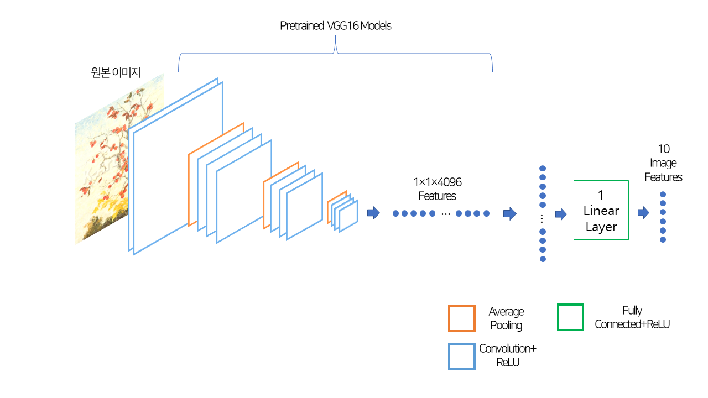
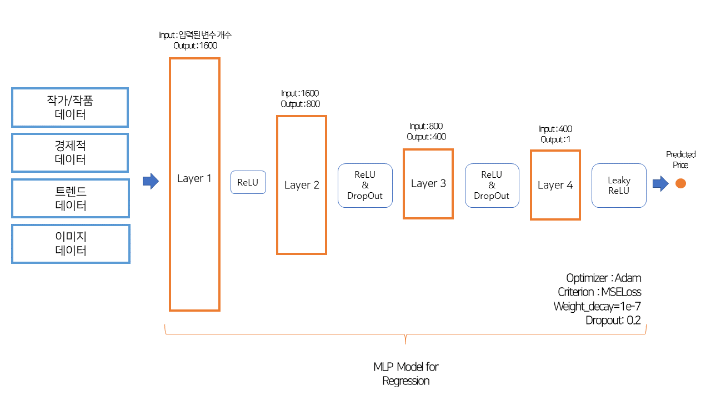
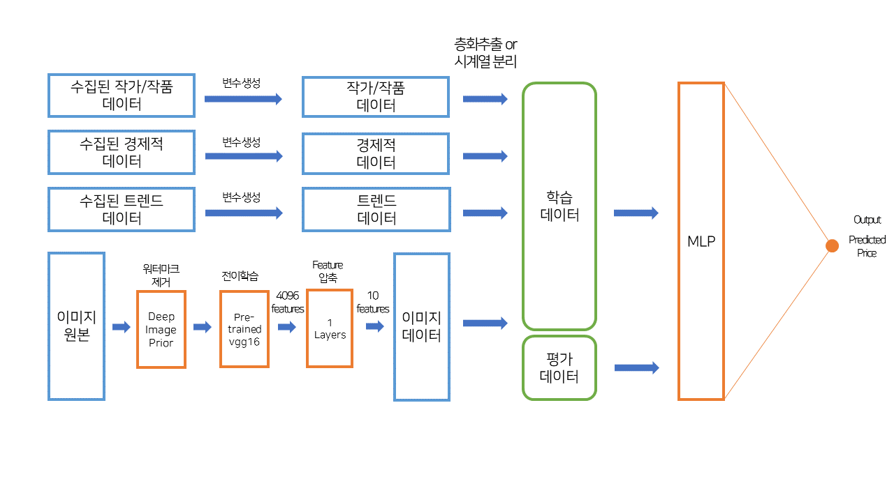

# 졸업논문연구

## 주제 : '이미지와 다면적 데이터를 활용한 미술품 경매가 예측'

## 실험 배경

- 미술품 경매시장이 2021년 기준 전년 대비 2배 이상 상승
- 미술품 경매시장 예측은 주관적인 요소가 많고 복합적인 요소들이 경매가 예측에 개입하여 예측하기 어려움
- 현재 미술품 경매시장의 예상경매가는 전문가의 판단 하에 진행됨.
- 이를 머신러닝으로 예측하는 한편, 예측에 중요한 변수 및 변수들의 조합을 파악하고자 함.

## 데이터 수집

- 미술품 및 작가 데이터
    - 미술품 데이터(이미지, 미술품 크기, 미술품의 재료 및 기법, 경매 주관사, 온라인 유통여부 등)
    - 작가 데이터(작가 수상경력, 개인전 및 단체적 유치 경력, 사망여부 등)
- 경제적 데이터
    - 거시경제적 지표(소비자물가, 부동산지수, 콜금리 등)
    - 일간 지표(KOSPI 100, 모건 스탠리 개발도상국 지표, 금 현물가 등)
    - 모든 경제적 데이터는 window sliding 기법을 활용해 Data leakage 방지처리함.
- 트렌드 데이터
    - '미술품 경매'에 관한 월간 뉴스 기사의 수
    - 네이버 트렌드를 활용한 미술품 경매 관련 키워드의 일간 빈도

## 데이터 전처리

- 미술품 및 작가 데이터
    - 미술품의 넓이, 높이, 너비 변수 생성
    - 미술품의 재료 및 기법을 더미화함
    - 미술품의 장르 및 경매사를 더미화함
    - 미술품 경매 낙찰 당시의 작가의 수상 횟수, 개인전 및 단체전 개최 횟수를 변수로 생성
    - 미술품 경매 당시의 작가 생존 여부 변수 생성
- 경제적 데이터
    - 일간 지표에 대해 이동평균, 모멘텀, 성장률, MACD, RSI의 변수 생성
- 트렌드 데이터
    - 경매 낙찰 기준으로 특정 기간 동안
        - 미술품 경매시장의 총 낙찰액 규모와 낙찰횟수 변수 생성
        - 해당 작가의 총 낙찰액 규모와 낙찰횟수 변수 생성
        - 위와 관련된 변화율에 관련된 변수 생성
- 이미지 데이터
    - 워터마크 제거
        - deep image prior 기법 활용
    - 변수 추출
        - vgg16 모델을 활용한 4096개의 변수 추출
        - 추출된 4096개의 변수를 layer를 추가하여 10개의 변수로 변환함
- 변수 선택
    - F-test와 Mutual Information을 활용하여 미술품 및 작가 데이터, 경제적 데이터, 트렌드 데이터로부터 변수를 20개씩 추출

## 실험 디자인

- 데이터셋 구성
    - 층화추출
    - 시계열
- 변수 사용

1. 전체 변수를 대상으로 실험
    1. 미술품 및 작가 데이터
    2. 미술품 및 작가 데이터+경제적 데이터
    3. 미술품 및 작가 데이터+트렌드 데이터
    4. 미술품 및 작가 데이터+이미지 데이터
    5. 미술품 및 작가 데이터+경제적 데이터+트렌드 데이터
    6. 이미지 데이터
    7. 전체 데이터
2. 변수 선택을 통한 실험
    1. 미술품 및 작가 데이터
    2. 미술품 및 작가 데이터+경제적 데이터
    3. 미술품 및 작가 데이터+트렌드 데이터
    4. 미술품 및 작가 데이터+경제적 데이터+트렌드 데이터

## 모델링

- 4 Layers MLP 모델 활용
- Activation Function : Relu & Leaky Relu
- Optimizer : Adam
- 평가 지표 : RMSE, MAE, MAPE

## 전체 실험 프로세스

